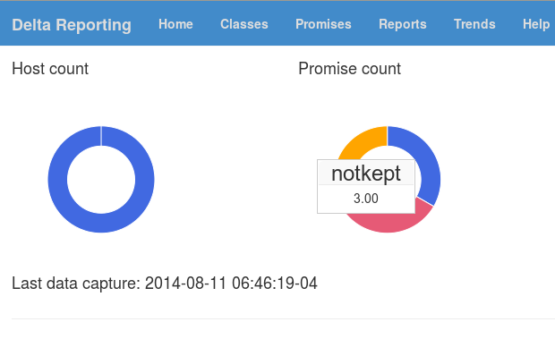

# delta\_reporting #

Delta Reporting provides centralized CFEngine class and promise reporting via a modern and responsive web application.



[More screenshots](Screenshots.md)

## Features ##
- Report on class membership history.
- Report on low level promise compliance history.
- Report missing hosts.
- Trend graphs for promise outcomes and host counts.
- Inventory reporting.
- Centralize all your CFEngine servers to a single reporting database.
- IPV6 ready.
- Use you existing database infrastructure.
- Sort and filter your report results.
- Save your reports in multiple formats.
- Command line report tool that outputs multiple formats.

## Demo ##

[demo.evolvethinking.com](http://demo.evolvethinking.com). User 'evolve', password 'thinking'.

## Requirements ##

### Client and Server ###
1. CFEngine 3.5.2. CFEngine 3.6 has outstanding bugs that prevent required Delta Reporting, and possibly your own, policies from working reliably. Stick with CFEngine 3.5.2 for now.
1. [EFL](https://github.com/evolvethinking/evolve\_cfengine\_freelib/), the Evolve Thinking free promise library. It very important that you know how to use this.
1. Perl 5.10+

#### Note about EFL ####

[EFL](https://github.com/evolvethinking/evolve\_cfengine\_freelib/) contains logging action and classes attributes that log promise outcomes for Delta Reporting to gather and process. EFL's promise bundles use these automatically. To use your own promises you will need to use these EFL action and classes attributes. See EFL bundles efl\_rkn, efl\_delta\_reporting, and the Delta Reporting architecture docs.

### Server ###

1. Tested on Debian and RHEL 6. May work on others if requirements are met.
1. Postgresql 8.3+
1. Apache recommended for proxy front end.
1. Perl Modules
  1. Mojolicious framework, included.
  1. Statistics::LineFit, included.
  1. Local::lib, included.
  1. Data::Dumper, for development only, not required for production.
  1. POSIX
  1. Getopt::Long
  1. Time::Local
  1. feature 'say', comes with perl 5.10+
  1. Net::DNS
  1. Sys::Hostname::Long 
  1. DBI
  1. DBD::Pg

## Support ##

Evolve Thinking is the creator and caretaker of Delta Reporting. They offer professional support services for Delta Reporting, CFEngine, and other IT services. ( http://evolvethinking.com ).

## How it works ##

Using the provided the CFEngine policy in delta\_reporting.cf all CFEngine class and all promises using EFL are logged by cf-agent on the host and stored for pickup by the policy server. The policy server downloads the log from every client and inserts them into the database.

## Installation ##

1. Install prerequisites.

1. Create database delta\_reporting.

1. Install contents of repo to /opt/delta\_reporting/.

1. Configure using DeltaR.conf. Be sure to configure your database properly for authentication and authorization. Two database users are required. 

1. Copy bin/delta\_reporting script to /etc/init.d. This is your start script. Run it.

1. Create a user 'deltar', home /opt/delta\_reporting, shell /bin/false.

1. Go to http://localhost:8080/initialize\_database.

1. You can DR run as is, or proxy behind Apache:

      ```apache
      <VirtualHost *:80>
         ServerName ettin.example.com
         ProxyPass / http://localhost:8080/
         ProxyPassReverse / http://localhost:8080/

         <LocationMatch /.*>
            AuthUserFile /etc/apache2/passwords.secret
            AuthType Basic
            AuthName 'Evolve Thinking Delta Reporting'
            Require valid-user
         </LocationMatch>
      </VirtualHost>
      ```

1. Install delta\_reporting.cf into your CFEngine policy. Run bundles in the following order. Use of EFL's main methods bundle is encouraged. Don't forget the null parameters.
  1. deltarep\_prelogging as early as possible on all hosts.
  1. deltarep\_postlogging as late as possible on all hosts.
  1. deltarep\_client\_get after deltarep\_postlogging on policy servers only.

1. Define the namespace class delta\_reporting for all hosts, as early as possible.

1. Install bin/dhlogmaker and configure CFEngine to install it on all hosts. /opt/delta\_reporting/bin/dhlogmaker suggested. 

1. Create server access promises that allow the policy server's agent to download from cf-serverd on all agents, including itself, the directory ${sys.workdir}/delta\_reporting. Use of the EFL bundle efl\_server is encouraged.

## Multiple CFEngine servers?

If you have mutiple CFEngine servers, install Delta Reporting on each, but point each to a central database. Now every server loads its client data to the central database and each can report on the data collected from all servers.

## License ##

Delta Reporting is a central server compliance log that uses CFEngine.

Copyright (C) 2013 Evolve Thinking http://evolvethinking.com

This program is free software: you can redistribute it and/or modify
it under the terms of the GNU General Public License as published by
the Free Software Foundation, either version 3 of the License, or
(at your option) any later version.

This program is distributed in the hope that it will be useful,
but WITHOUT ANY WARRANTY; without even the implied warranty of
MERCHANTABILITY or FITNESS FOR A PARTICULAR PURPOSE.  See the
GNU General Public License for more details.

You should have received a copy of the GNU General Public License
along with this program.  If not, see <http://www.gnu.org/licenses/>.
