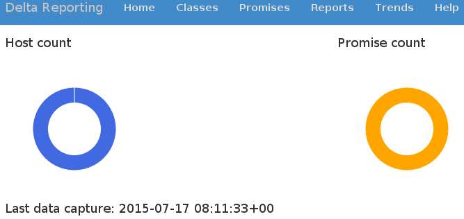

# Description

A Vagrantfile and Ansible playbook to launch a virtual machine by using
VirtualBox as a provider, and provisioning it by installing CFEngine 3.7
and Delta Reporting.
As base box debian/wheezy64 is being used.

# Requirements

What you need:

* Vagrant
* VirtualBox
* Ansible

# Launch it

Just run the following command:

```
$ vagrant up --provision
```

Ansible will write the following message after it is done:

```
ok: [default] => {
      "msg": "Visit following link http://localhost:8080/initialize_database"
}
```

Follow that link to initialize the database. After 5 minutes you should
see the result of the first CFEngine run:



For the unpatient:

```
$ vagrant ssh
vagrant@debian-wheezy:~$ sudo cf-agent -KI
```

And after a refresh of the browser you should see the same as above.
